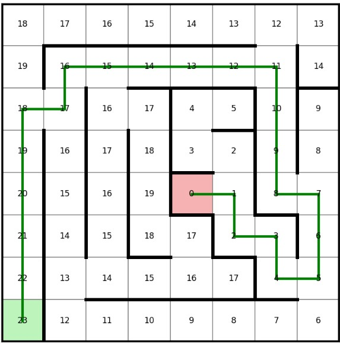
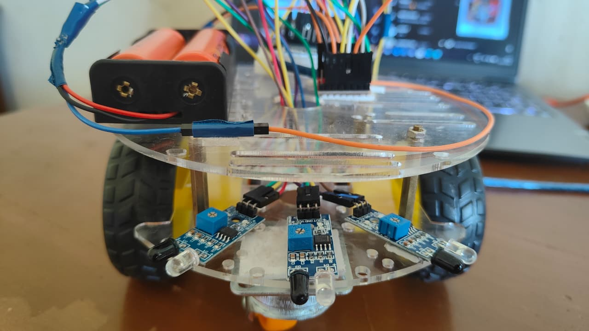
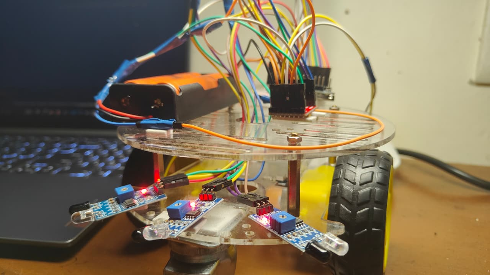
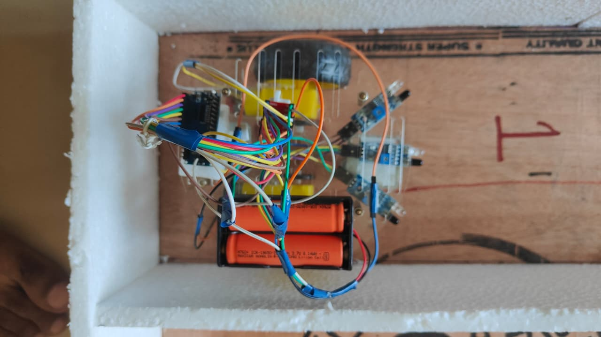
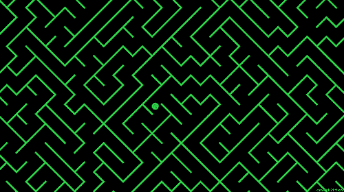

# **Maze Solving MicroMouse**


***Maze Solving MicroMouse*** is a complete hardware and software project focused on the design, simulation, and implementation of an autonomous maze-solving robot. This repository includes Arduino-based firmware for the physical Micromouse and a Python simulation environment for maze creation, algorithm testing, and path visualization.

## Features

- **Autonomous Maze Solving**: Navigates unknown mazes by detecting walls, building an internal map, and determining the most efficient route to the target.

- **Flood Fill Pathfinding Algorithm**: Utilizes the Flood Fill algorithm to calculate distance values, explore the maze intelligently, and identify the shortest path to the goal.

- **Arduino-Based Robot Control**: Includes complete firmware for the physical Micromouse robot, handling sensor integration, motor control, maze mapping, and real-time decision-making.

- **Python Simulation Environment**: Provides a simulation platform built with NumPy and Matplotlib for algorithm development, testing, and performance evaluation before deployment to hardware.

- **Hardware and Software Integration**: Demonstrates the complete workflow from simulation and algorithm validation to deployment on a physical autonomous robot.


## Repository Structure

```
├── Doc/
│   └── Doc/MicroMouse010_io (last_draft).pdf # Certified Documentation of the project
├── MicroMouseCode/
│   └── Maze_solving_code.ino   # Arduino firmware for the robot
├── Stimulation/
│   ├── Customized_maze.py      # Interactive script to create custom mazes
│   ├── Solver_code.py          # Simulates the flood-fill algorithm and visualizes the path
│   └── Sample_Coordinates.py   # An example output file from the maze generator
└── LICENSE                     # MIT License
```

## How to Use

### 1.Simulation
 

The simulation allows you to create a maze and visualize how the flood-fill algorithm solves it.

**Prerequisites:**
- Python 3
- NumPy
- Matplotlib

Install dependencies:
```bash
pip install -r requirements.txt
```

**Steps:**
1.  **Generate a Maze:** Run the custom maze generator.
    ```bash
    python Stimulation/Customized_maze.py
    ```
    An interactive grid will appear. Click on the grid lines to add or remove walls. When you are finished, click the "save maze" button. This will create a file named `maze_8x8.py` in the current directory.

2.  **Run the Solver:** Execute the solver script to see the algorithm in action on your custom maze.
    ```bash
    python Stimulation/Solver_code.py
    ```
    This will display a window showing the maze, the calculated distance values for each cell from the goal, and the shortest path highlighted in green.

### 2.Hardware (Micromouse Robot)

<p align="center">
  
   
  
</p>

The `Maze_solving_code.ino` file is designed to be uploaded to an Arduino-compatible microcontroller controlling the Micromouse.

**Hardware Components:**
*   An Arduino or compatible board
*   L298N or similar Motor Driver (TB6612FNG is referenced by pin names)
*   2x DC Motors
*   3x IR Sensors (Left, Front, Right) for wall detection
*   Robot chassis and power supply

**Pin Configuration:**

The firmware is configured with the following pin connections:

| Component      | Pin         | Arduino Pin |
|----------------|-------------|-------------|
| **IR Sensors** | Left        | 2           |
|                | Front       | 3           |
|                | Right       | 4           |
| **Motor A**    | PWM (PWMA)  | 5           |
|                | IN1 (AIN1)  | 8           |
|                | IN2 (AIN2)  | 9           |
| **Motor B**    | PWM (PWMB)  | 6           |
|                | IN1 (BIN1)  | 10          |
|                | IN2 (BIN2)  | 11          |
| **Motor Driver**| Standby (STBY)| 7           |

**Instructions:**
1.  Connect your hardware according to the pin configuration table.
2.  Open `MicroMouseCode/Maze_solving_code.ino` in the Arduino IDE.
3.  Install any necessary libraries for your hardware if not already present.
4.  Select your board and port from the `Tools` menu.
5.  Upload the sketch to your robot.
6.  Place the robot at the starting cell (0,0). The robot will wait for 4 seconds before starting its run.

## Algorithm Explained


This project uses the **Flood Fill Algorithm** to navigate the maze.

The **Flood Fill Algorithm** is used to determine the shortest path from any cell in the maze to the goal.

1. **Set the Goal Cell** The target cell is assigned a distance value of `0` and added to a queue.
2. **Propagate Distances** Starting from the goal, the algorithm expands outward to all reachable neighboring cells. Each neighboring cell receives a value that is one greater than the current cell ($+1$).
3. **Continue Filling** This process repeats until every accessible cell in the maze has been assigned a distance value representing its minimum number of moves to reach the goal.
4. **Update with New Walls** As the robot explores and discovers walls, the distance map is recalculated to account for blocked paths and ensure the values remain accurate.
5. **Choose the Next Move** At each step, the robot compares the distance values of its accessible neighboring cells and moves to the one with the lowest value.

---

> 💡 **Key Principle:** Since the distance values decrease as the robot approaches the goal, continuously moving to the lowest-valued neighboring cell guarantees progress toward the shortest known path.

---

---

## 🤝 Let's Collaborate!

Thank you for checking out this project! Whether you want to report a bug, suggest an optimization for the maze-solving logic, or just talk about robotics and AI, contributions and discussions are always welcome.

### 🚀 How to Get Involved
* **Report Issues:** Open an issue if you spot a bug or an edge-case wall layout that breaks the flood fill.
* **Pull Requests:** Feel free to fork the repository, optimize the algorithm, and submit a PR.
* **Feedback:** Drop your thoughts or suggestions in the discussions tab.

---

<p align="center">
  <b>Made with ❤️ by Alan Francis</b><br>
  📬 Reach out at <a href="mailto:alanfrancis347@gmail.com">alanfrancis347@gmail.com</a>
</p>

## License

This project is licensed under the MIT License. See the [LICENSE](LICENSE) file for details.
