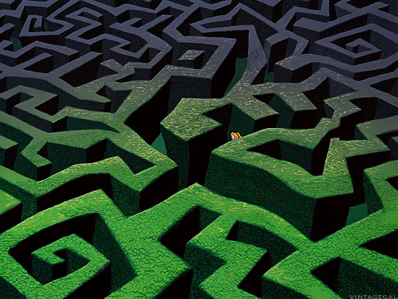

# Maze_Solving_MicroMouse


This repository contains the complete hardware and software implementation for a maze-solving Micromouse robot. The project includes Arduino firmware for the robot and a Python-based simulation environment to design mazes and visualize the solving algorithm.

The core of the project is the Flood Fill algorithm, which enables the robot to explore, map, and find the shortest path through an unknown maze to a central target.

## Features

- **Flood Fill Algorithm**: Implements the flood fill algorithm for efficient maze solving and pathfinding.
- **Arduino Firmware**: The `Maze_solving_code.ino` file contains the complete logic for the physical robot, including sensor reading, motor control, and algorithm execution.
- **Python Simulation**: A simulation environment built with Matplotlib and NumPy to test the algorithm.
- **Custom Maze Generator**: An interactive tool (`Customized_maze.py`) to draw, create, and save custom maze layouts.
- **Path Visualization**: The solver script (`Solver_code.py`) visualizes the flood fill distance values and the optimal path found from start to goal.

## Repository Structure

```
├── MicroMouseCode/
│   └── Maze_solving_code.ino   # Arduino firmware for the robot
├── Stimulation/
│   ├── Customized_maze.py      # Interactive script to create custom mazes
│   ├── Solver_code.py          # Simulates the flood-fill algorithm and visualizes the path
│   └── Sample_Coordinates.py   # An example output file from the maze generator
└── LICENSE                     # MIT License
```

## How to Use

### Simulation

The simulation allows you to create a maze and visualize how the flood-fill algorithm solves it.

**Prerequisites:**
- Python 3
- NumPy
- Matplotlib

Install dependencies:
```bash
pip install numpy matplotlib
```

**Steps:**
1.  **Generate a Maze:** Run the custom maze generator.
    ```bash
    python Stimulation/Customized_maze.py
    ```
    An interactive grid will appear. Click on the grid lines to add or remove walls. When you are finished, click the "save maze" button. This will create a file named `maze_8x8.py` in the current directory.

2.  **Run the Solver:** Execute the solver script to see the algorithm in action on your custom maze.
    ```bash
    python Stimulation/Solver_code.py
    ```
    This will display a window showing the maze, the calculated distance values for each cell from the goal, and the shortest path highlighted in green.

### Hardware (Micromouse Robot)

The `Maze_solving_code.ino` file is designed to be uploaded to an Arduino-compatible microcontroller controlling the Micromouse.

**Hardware Components:**
*   An Arduino or compatible board
*   L298N or similar Motor Driver (TB6612FNG is referenced by pin names)
*   2x DC Motors
*   3x IR Sensors (Left, Front, Right) for wall detection
*   Robot chassis and power supply

**Pin Configuration:**

The firmware is configured with the following pin connections:

| Component      | Pin         | Arduino Pin |
|----------------|-------------|-------------|
| **IR Sensors** | Left        | 2           |
|                | Front       | 3           |
|                | Right       | 4           |
| **Motor A**    | PWM (PWMA)  | 5           |
|                | IN1 (AIN1)  | 8           |
|                | IN2 (AIN2)  | 9           |
| **Motor B**    | PWM (PWMB)  | 6           |
|                | IN1 (BIN1)  | 10          |
|                | IN2 (BIN2)  | 11          |
| **Motor Driver**| Standby (STBY)| 7           |

**Instructions:**
1.  Connect your hardware according to the pin configuration table.
2.  Open `MicroMouseCode/Maze_solving_code.ino` in the Arduino IDE.
3.  Install any necessary libraries for your hardware if not already present.
4.  Select your board and port from the `Tools` menu.
5.  Upload the sketch to your robot.
6.  Place the robot at the starting cell (0,0). The robot will wait for 4 seconds before starting its run.

## Algorithm Explained

This project uses the **Flood Fill Algorithm** to navigate the maze.

1.  **Initialization**: The maze is represented as a 2D grid. Each cell is assigned a distance value, initially calculated using Manhattan distance to the goal. The goal cell has a distance of 0.
2.  **Exploration**: The robot moves from cell to cell. At each cell, it uses its IR sensors to detect walls to its front, left, and right. This wall information is stored in a 3D array (`wall[x][y][direction]`).
3.  **Recalculation (Flood Fill)**: After updating the wall map, the algorithm recalculates the distance values for all cells. The distance of a cell is set to `1 + minimum distance of its accessible neighbors`. This process repeats until the distance values stabilize.
4.  **Movement**: To decide its next move, the robot checks its accessible neighboring cells and always moves to the one with the lowest distance value.
5.  **Goal**: This process continues until the robot reaches the target cell (where distance is 0).

## License

This project is licensed under the MIT License. See the [LICENSE](LICENSE) file for details.
